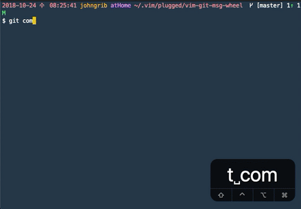

# vim-git-msg-wheel

Show recent git commit messages and support line autocompletion.

[English](README.md) [한국어](README_kr.md)



# Why should I use this?

It would not be a good git usage habit to reuse commit messages.

Sometimes, however, I see the old commit message and try to recycle it.

* View recent commit messages as a list.
* You can autocomplete and modify old commit messages and write new commit messages.

# Installation

## VimPlug

Place this in your .vimrc:

```viml
Plug 'johngrib/vim-git-msg-wheel'
```

Then run the following in Vim:

```
:source %
```

```
:PlugInstall
```

# Configuraion

## define auto complete key

* default value is `<C-l>`

```viml
# use ctrl+a to show commit message auto complete list
let g:git_msg_wheel_key = '<C-a>'
```

## number of commit messages to import

* default value is `50`

```viml
let g:git_msg_wheel_length = 100
```

## show/hide old commit messages in comment

* default value is `1`

```viml
let g:git_msg_wheel_list_show = 0   " hide list
```

